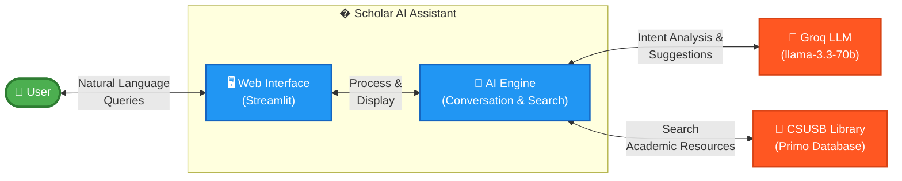

# Scholar AI Assistant - Architecture Documentation

## High-Level Architecture Diagram

### 🎯 System Overview

**Scholar AI Assistant** is a conversational AI chatbot that helps users discover academic resources from the CSUSB library through natural language interactions.

| Component | Purpose |
|-----------|---------|
| **👤 User** | Researchers and students seeking academic resources |
| **🖥️ Web Interface** | Streamlit-based chat interface for user interaction |
| **🧠 AI Engine** | Processes queries, extracts parameters, executes searches |
| **🤖 Groq LLM** | Provides natural language understanding and generation |
| **📖 CSUSB Library** | Academic resource database (articles, books, journals) |

### 🔄 Simple Workflow

1. User asks a question in natural language
2. AI Engine analyzes intent using Groq LLM
3. AI Engine searches CSUSB Library database
4. Results displayed in organized table format
5. AI provides follow-up suggestions or clarifying questions

---

