# Scholar AI Assistant - Architecture Documentation

## High-Level Architecture Diagram

```mermaid
graph LR
    User([👤 User])
    
    subgraph System["� Scholar AI Assistant"]
        UI["🖥️ Web Interface<br/>(Streamlit)"]
        AI["🧠 AI Engine<br/>(Conversation & Search)"]
    end
    
    LLM["🤖 Groq LLM<br/>(llama-3.3-70b)"]
    Library["📖 CSUSB Library<br/>(Primo Database)"]
    
    User <-->|"Natural Language<br/>Queries"| UI
    UI <-->|"Process &<br/>Display"| AI
    AI <-->|"Intent Analysis &<br/>Suggestions"| LLM
    AI <-->|"Search<br/>Academic Resources"| Library
    
    %% Styling
    classDef userStyle fill:#4CAF50,stroke:#2E7D32,stroke-width:3px,color:#fff
    classDef systemStyle fill:#2196F3,stroke:#1565C0,stroke-width:2px,color:#fff
    classDef externalStyle fill:#FF5722,stroke:#D84315,stroke-width:2px,color:#fff
    
    class User userStyle
    class UI,AI systemStyle
    class LLM,Library externalStyle
```

### 🎯 System Overview

**Scholar AI Assistant** is a conversational AI chatbot that helps users discover academic resources from the CSUSB library through natural language interactions.

| Component | Purpose |
|-----------|---------|
| **👤 User** | Researchers and students seeking academic resources |
| **🖥️ Web Interface** | Streamlit-based chat interface for user interaction |
| **🧠 AI Engine** | Processes queries, extracts parameters, executes searches |
| **🤖 Groq LLM** | Provides natural language understanding and generation |
| **📖 CSUSB Library** | Academic resource database (articles, books, journals) |

### 🔄 Simple Workflow

1. User asks a question in natural language
2. AI Engine analyzes intent using Groq LLM
3. AI Engine searches CSUSB Library database
4. Results displayed in organized table format
5. AI provides follow-up suggestions or clarifying questions

---

## Detailed System Architecture Diagram

## Architecture Overview

### Layer Descriptions

#### 1. 🖥️ User Interface Layer (Streamlit)
- **`app.py`**: Main application entry point and orchestrator
- **`ChatOrchestrator`**: Handles user interactions and delegates to business services
- **UI Components**: Renders sidebar, chat messages, and result tables
- **Session State**: Manages conversation history, search results, and user preferences

#### 2. 🧠 Core Business Logic
**Services** (following Single Responsibility Principle):
- **`ConversationAnalyzer`**: Extracts user intents, search parameters, and date filters from conversations
- **`SearchService`**: Coordinates library searches with filtering and pagination
- **`SuggestionService`**: Generates alternative search suggestions when no results found
- **`ResultFormatter`**: Parses and formats search results for display

**Interfaces** (Dependency Inversion Principle):
- **`ILLMClient`**: Contract for Language Model interactions
- **`ILibraryClient`**: Contract for library database access
- **`IPromptProvider`**: Contract for prompt template management

#### 3. 🔌 External Clients
- **`GroqClient`**: Wrapper for Groq LLM API (implements `ILLMClient`)
- **`CSUSBLibraryClient`**: Wrapper for CSUSB Primo Library API (implements `ILibraryClient`)

#### 4. 🛠️ Utilities
- **`PromptManager`**: Centralized management of AI prompts (implements `IPromptProvider`)
- **Date utilities**: Date parsing and normalization for search filters
- **Error handling**: Centralized error management
- **Logging**: Application-wide logging utilities

#### 5. 🌐 External APIs
- **Groq LLM API**: Provides AI capabilities using llama-3.3-70b-versatile model
- **CSUSB Primo API**: Library database for searching academic resources
