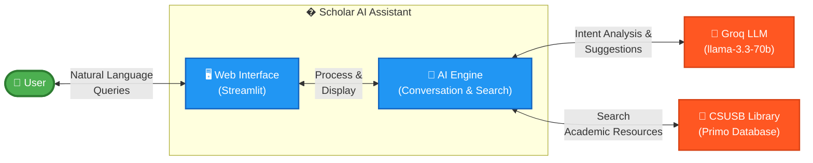

# Scholar AI Assistant - Architecture Documentation

## High-Level Architecture Diagram

```mermaid
graph LR
    User([👤 User])
    
    subgraph System["� Scholar AI Assistant"]
        UI["🖥️ Web Interface<br/>(Streamlit)"]
        AI["🧠 AI Engine<br/>(Conversation & Search)"]
    end
    
    LLM["🤖 Groq LLM<br/>(llama-3.3-70b)"]
    Library["📖 CSUSB Library<br/>(Primo Database)"]
    
    User <-->|"Natural Language<br/>Queries"| UI
    UI <-->|"Process &<br/>Display"| AI
    AI <-->|"Intent Analysis &<br/>Suggestions"| LLM
    AI <-->|"Search<br/>Academic Resources"| Library
    
    %% Styling
    classDef userStyle fill:#4CAF50,stroke:#2E7D32,stroke-width:3px,color:#fff
    classDef systemStyle fill:#2196F3,stroke:#1565C0,stroke-width:2px,color:#fff
    classDef externalStyle fill:#FF5722,stroke:#D84315,stroke-width:2px,color:#fff
    
    class User userStyle
    class UI,AI systemStyle
    class LLM,Library externalStyle
```

### 🎯 System Overview

